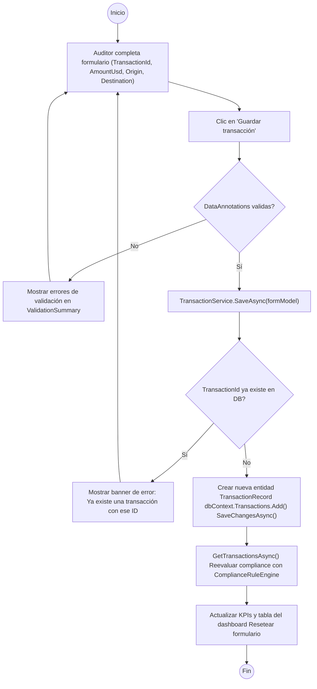
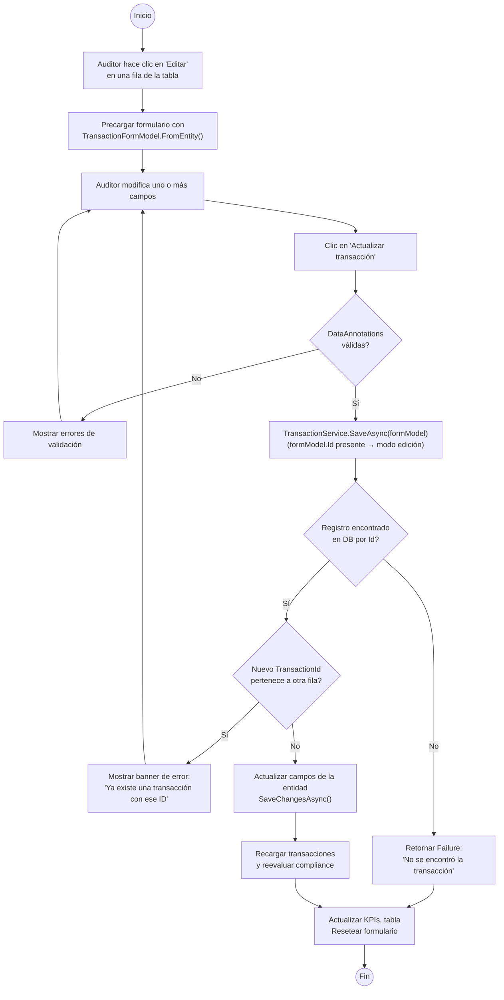
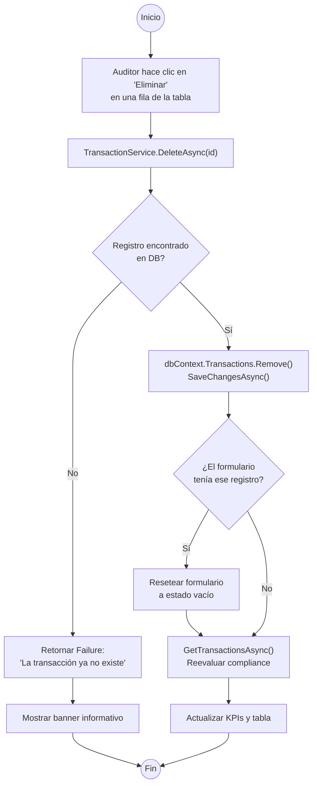
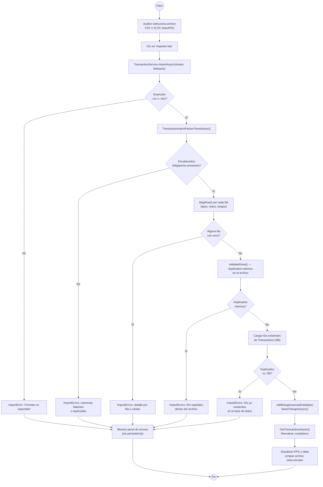
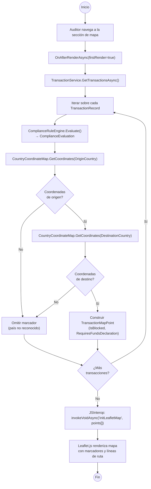
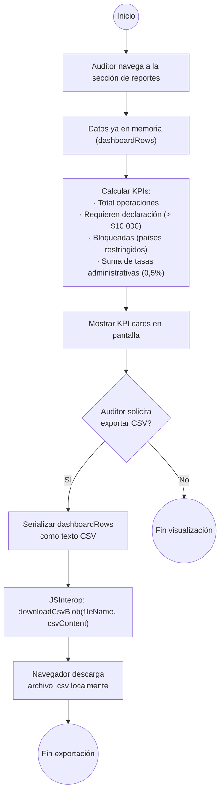

# Activity Diagrams — Corvux AML Compliance Dashboard

Diagramas de actividad en formato `flowchart TD` (Mermaid) para los seis casos de uso.
Los colores de nodo siguen la convención: inicio/fin en círculo, decisión en rombo, proceso en rectángulo.

---

## AD01 — Registrar transacción manual

---

## AD02 — Editar transacción

---

## AD03 — Eliminar transacción

---

## AD04 — Importar lote CSV/XLSX

---

## AD05 — Visualizar mapa geográfico

---

## AD06 — Consultar reporte

