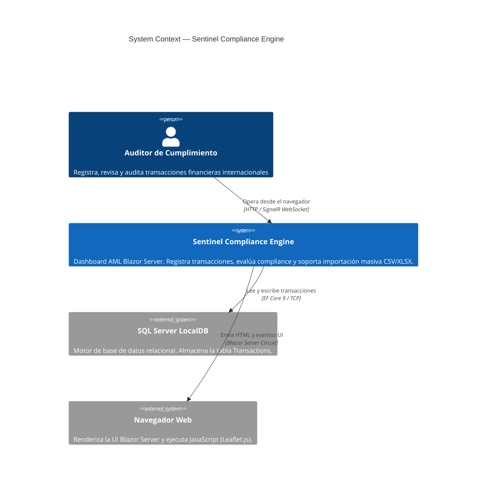
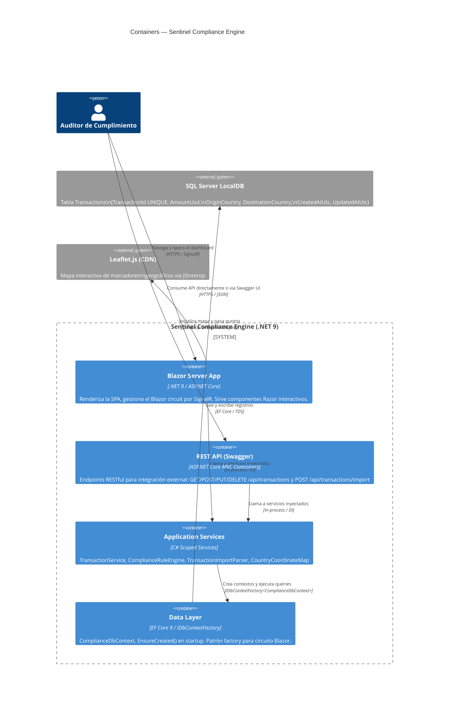
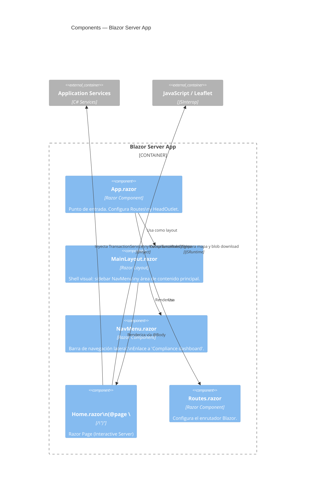
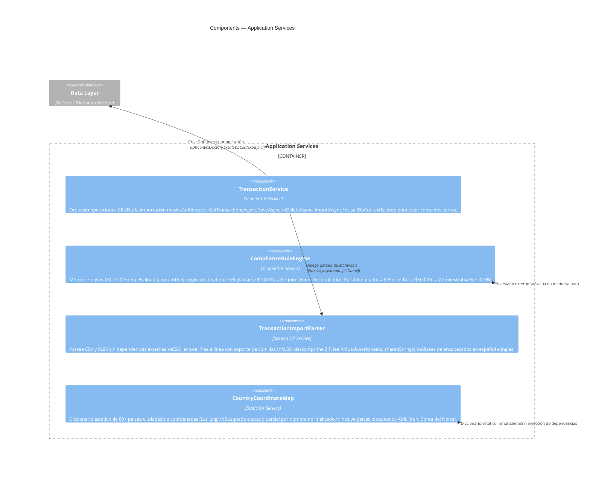
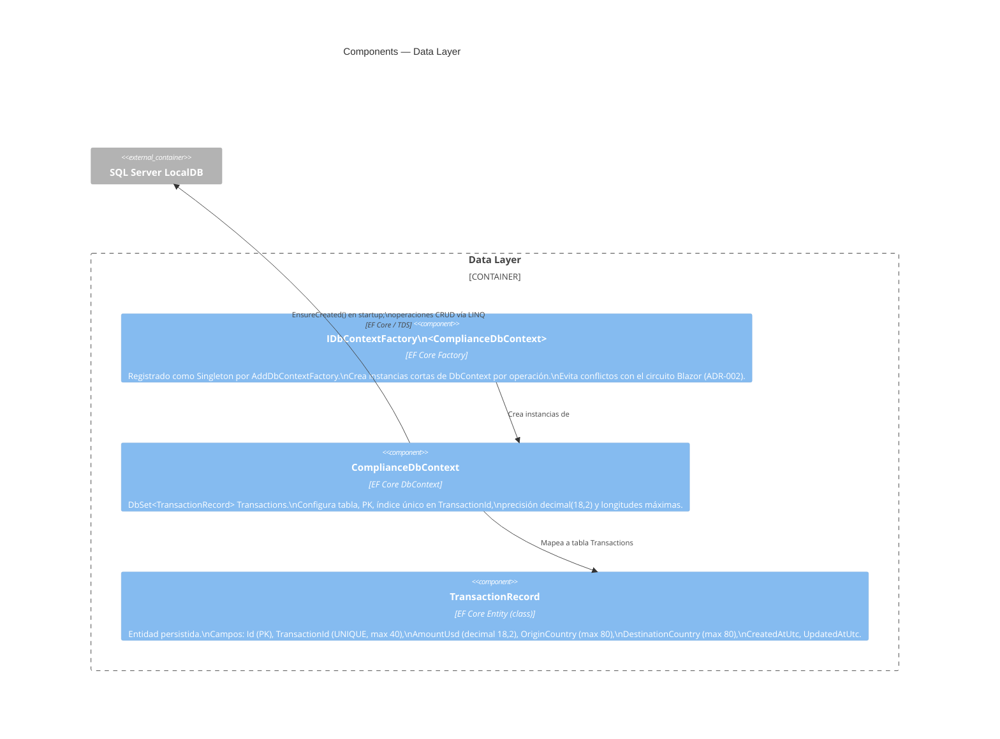
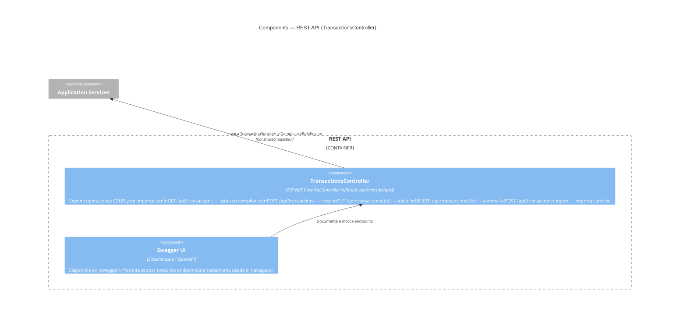

# C4 Architecture Model — Corvux AML Compliance Dashboard

Modelo C4 a tres niveles usando Mermaid. Convención de colores:
- Azul oscuro → sistema principal
- Azul claro → actor / usuario
- Gris → sistema externo
- Verde → contenedor o componente interno

Referencias: [C4 Model](https://c4model.com/) · ADR-002 (IDbContextFactory Blazor Server)

---

## Level 1 — System Context

Muestra el sistema como una caja negra con sus actores y sistemas externos.

---

## Level 2 — Containers

Descompone el sistema en sus contenedores de ejecución.

---

## Level 3 — Components

Descompone los contenedores internos en sus componentes de código.

### Components — Blazor Server App

### Components — Application Services

### Components — Data Layer

### Components — REST API

---

## Resumen de decisiones arquitectónicas reflejadas en el modelo

| Decisión | Impacto visible en el C4 |
|---|---|
| **IDbContextFactory** (ADR-002) | Data Layer usa factory en vez de DbContext scoped para sobrevivir al circuito Blazor |
| **Blazor Server** (no WASM) | El circuito SignalR mantiene estado en servidor; JSInterop necesario para operaciones DOM puras |
| **Corte preventivo en import** | `TransactionService.ImportAsync` valida completamente antes de abrir transacción de escritura |
| **Sin migraciones EF** | `EnsureCreated()` en startup; apropiado para SQL Server LocalDB en desarrollo |
| **Servicios Scoped** | `ComplianceRuleEngine`, `TransactionImportParser`, `TransactionService` son Scoped — un circuito = un scope |
| **CountryCoordinateMap estático** | Cero I/O, cero DI; datos geográficos inmutables que no justifican base de datos |
