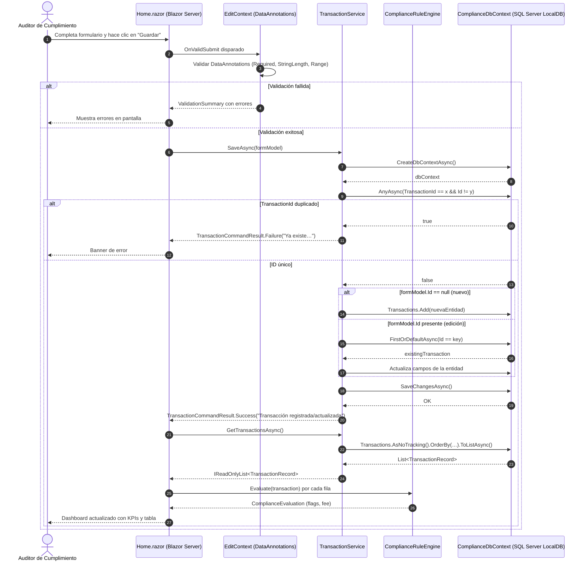
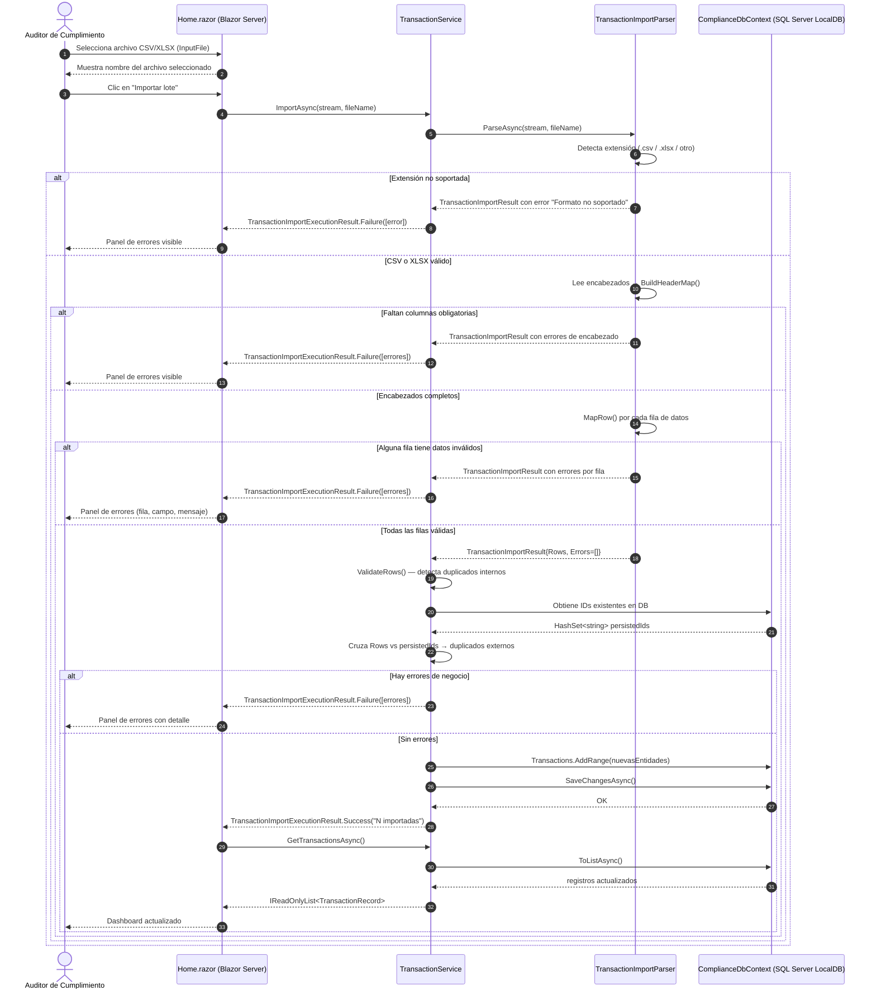
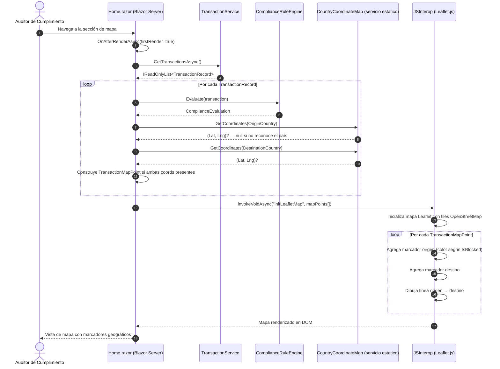
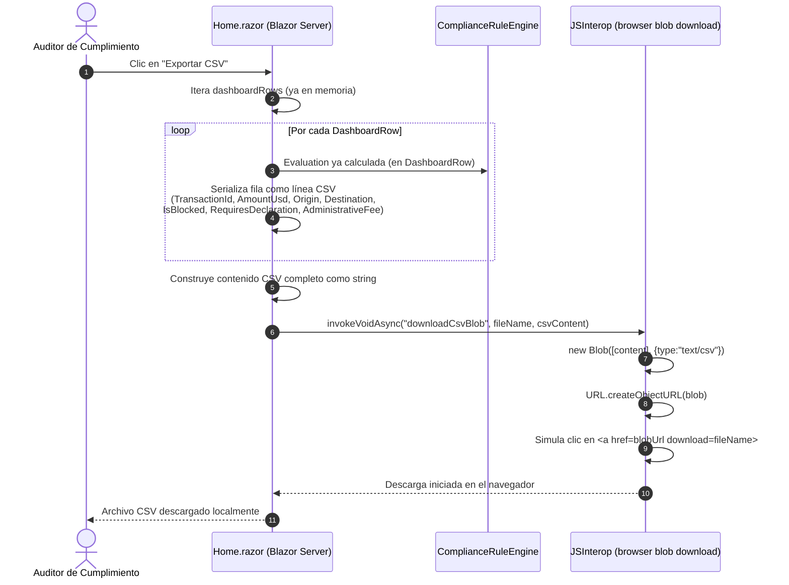

# Sequence Diagrams — Corvux AML Compliance Dashboard

Los siguientes diagramas detallan los flujos de interacción entre el navegador (Blazor circuit),
los servicios de la capa de aplicación y la base de datos SQL Server LocalDB.

---

## SD01 — Registrar transacción manual

Cubre tanto el registro (nuevo) como la edición (formModel.Id presente). La diferencia en
`TransactionService.SaveAsync` es si se hace `Add` o se actualiza la entidad existente.

---

## SD02 — Importar lote CSV/XLSX

El flujo aplica un **corte preventivo total**: si cualquier fila contiene errores de formato
o duplicidad, no se persiste ningún registro.

---

## SD03 — Cargar mapa geográfico

El mapa resuelve coordenadas de país mediante `CountryCoordinateMap` (diccionario estático)
y las entrega a Leaflet.js vía JSInterop en `OnAfterRenderAsync`.

---

## SD04 — Exportar reporte CSV

El reporte se genera completamente en el lado del cliente mediante un blob URL de JavaScript,
evitando un round-trip al servidor.

