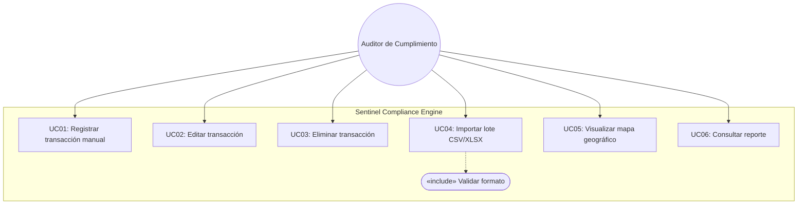
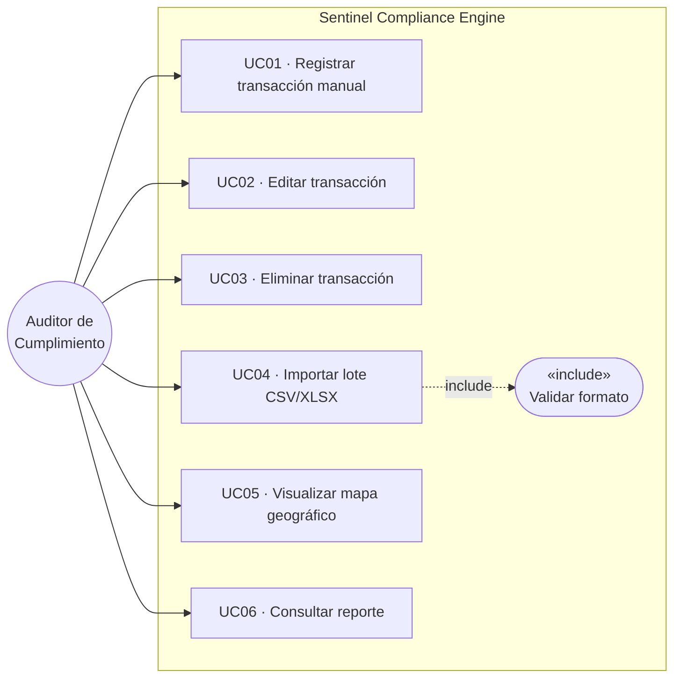
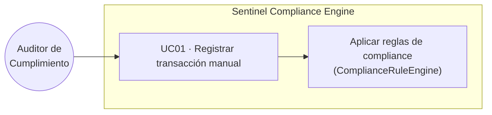
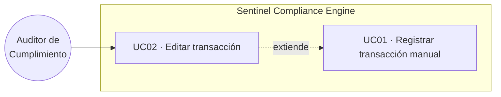
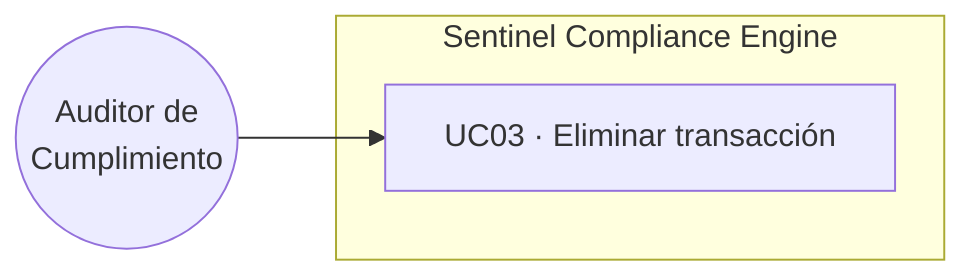
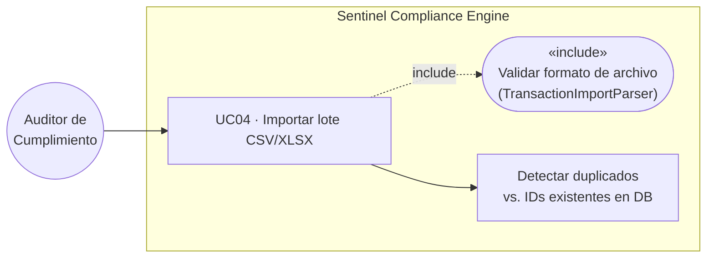
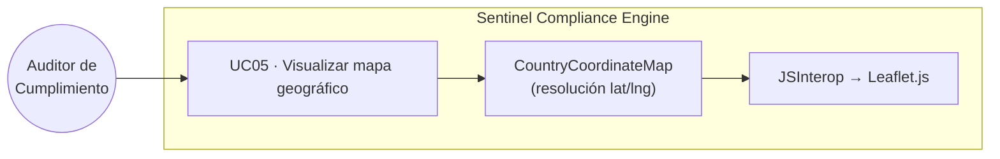
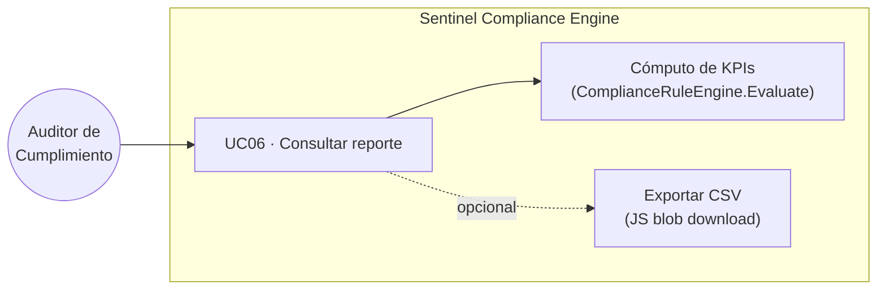

# Use Cases — Corvux AML Compliance Dashboard

**Actor único:** Auditor de Cumplimiento
**Sistema:** Sentinel Compliance Engine (Blazor Server / .NET 9)

---

## Diagrama de visión general

> Nota: Mermaid no soporta sintaxis `usecase-diagram` nativa; los diagramas individuales
> a continuación usan `graph LR` como representación compatible con todos los renderizadores.

---

## Visión general — formato compatible Mermaid

---

## UC01 — Registrar transacción manual

| Atributo | Detalle |
|---|---|
| **Actor** | Auditor de Cumplimiento |
| **Precondición** | SQL Server LocalDB disponible |
| **Flujo principal** | El auditor completa el formulario (TransactionId, AmountUsd, OriginCountry, DestinationCountry) y confirma |
| **Flujo alternativo** | El campo TransactionId ya existe → se muestra error, no se persiste |
| **Postcondición** | Nueva fila en la tabla `Transactions`; KPIs del dashboard actualizados |
| **Reglas de negocio** | AmountUsd > 10 000 → flag "Requiere declaración"; país bloqueado → flag "Operación bloqueada"; AmountUsd > 50 000 → tasa 0,5% |

---

## UC02 — Editar transacción

| Atributo | Detalle |
|---|---|
| **Actor** | Auditor de Cumplimiento |
| **Precondición** | Al menos una transacción registrada |
| **Flujo principal** | El auditor hace clic en "Editar" en la tabla → el formulario se precarga con los datos existentes → modifica campos → confirma |
| **Flujo alternativo** | El nuevo TransactionId ya pertenece a otra fila → error, sin cambios en DB |
| **Postcondición** | `UpdatedAtUtc` actualizado; tabla y KPIs recargados |

---

## UC03 — Eliminar transacción

| Atributo | Detalle |
|---|---|
| **Actor** | Auditor de Cumplimiento |
| **Precondición** | La transacción existe en la base de datos |
| **Flujo principal** | El auditor hace clic en "Eliminar" → `TransactionService.DeleteAsync` borra la fila |
| **Flujo alternativo** | La transacción ya no existe (race condition) → mensaje informativo, sin error fatal |
| **Postcondición** | Fila eliminada; si el registro estaba en edición, el formulario se reinicia |

---

## UC04 — Importar lote CSV/XLSX

| Atributo | Detalle |
|---|---|
| **Actor** | Auditor de Cumplimiento |
| **Precondición** | Archivo con extensión `.csv` o `.xlsx` |
| **Flujo principal** | Selecciona archivo → "Importar lote" → `TransactionImportParser.ParseAsync` → validación de negocio → `TransactionService.ImportAsync` → persistencia en lote |
| **Flujo alternativo** | Cualquier error de formato o duplicidad → importación cancelada completamente; se muestran todas las incidencias |
| **Postcondición** | N nuevas filas en `Transactions`; KPIs actualizados |
| **«include»** | ValidarFormato: verifica encabezados obligatorios (TransactionId, AmountUsd, OriginCountry, DestinationCountry) y tipos de datos por fila |

---

## UC05 — Visualizar mapa geográfico

| Atributo | Detalle |
|---|---|
| **Actor** | Auditor de Cumplimiento |
| **Precondición** | Al menos una transacción con países resolubles por `CountryCoordinateMap` |
| **Flujo principal** | Navega a la sección de mapa → `CountryCoordinateMap.GetCoordinates` resuelve lat/lng → JSInterop inicializa Leaflet con marcadores de origen y destino |
| **Flujo alternativo** | País no encontrado en el diccionario → marcador omitido sin error |
| **Postcondición** | Mapa renderizado con marcadores diferenciados (bloqueados en rojo) |

---

## UC06 — Consultar reporte

| Atributo | Detalle |
|---|---|
| **Actor** | Auditor de Cumplimiento |
| **Precondición** | Al menos una transacción registrada |
| **Flujo principal** | El dashboard calcula KPIs en tiempo real: total de operaciones, requieren declaración, bloqueadas, suma de tasas administrativas; opcionalmente exporta como CSV via JS blob download |
| **Postcondición** | Archivo CSV descargado en el navegador o KPIs visualizados en pantalla |

